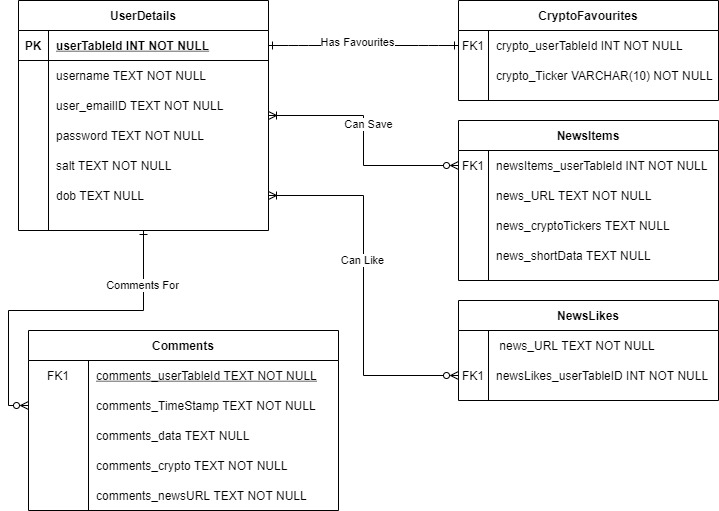

# CryptoBase

###### IN CASE OF ANY ERRORS WHILE STARTING THE PROJECT PLEASE FEEL FREE TO CONTACT US AT
trajop2@uic.edu, awagad2@uic.edu , obusar2@uic.edu 

## Team

Akshat Wagadre, Olatunji Busari, Tejas Rajopadhye

## Starting the Backend Server

Please add a .env file and copy and paste the below configuration

```
port=1337
cookieMaxAge=3600000
minPasswordLength=8
secret="8812nkj12891nkfjhsdfk23"
dbName="cryptoBaseDB"
sessionsDb=sessions

```

```
$ cd Assignment_2_Backend
$ npm i
$ npm start

```

## Starting the Frontend Server

```
$ cd Assignment_2_Frontend
$ npm i
$ npm start

```
### While installing dependencies for frontend , if you get any issues that are specific to OS, system architecture, please run the below commands,
```
$ cd Assignment_2_Frontend
$ npm i -f
$ npm start

```

## Guide to accessing web application

1. Goto http://localhost:3000/
2. Click on 'SignUp' and create the user by entering the appropriate details.
3. Once the user is created, you will be redirected to login page.
4. Now with those credentials, login into the website.

## Unit testing with JEST and plan ahead

Details about unit testing for critical modules is given below, to run the unit test, please run the below command

```

$ npm run test

```
#### Password Related Tests

##### Password Length Strength Test 
1. Normal Usage - This tests verifies if the passwordlength is permissible when a password with permissible length is provided. For this application password with length > 8 are considered permissible. This test is named as "Positive Test Case for Correct Input"

2. Erroneuos Usage - This test verifies the functionality of password lenght checker in case the password lenght is < 8 . This test is named as "Negative Test case for Incorrect Input" . Here password with length = 4 is passed and checked if the function returns 'false' which indicates the correctness of this test

##### Password Hashing Related Test
1. Normal Usage - This tests verifies for the given password, a hash and salt is generated and does verify this by validating the password with the salt by rehashing and checking the generated hash

2. Negative Usage - In this test, for the password the salt for the password is changed and then the password and salt combinations are revalidated . Failure is to be expected in this test

#### CRUD operations related Units Tests 

##### Create User Test
For this test , the sample user object is created and inserted into the database . The response for the function is checked in this case

##### Get Data For Test
For this test, the sample user created previous is used and data for the same is pulled from DB and the object returned is checked

##### Update Data for user
For this test , data is updated for a user and the data which is updated is checked by querying the data from the DB and checking the fields that were supposed to change

##### Delete User
For this test , user's email ID is provided to be deleted from the data. The response from the function/ DB is checked for the test


### Plan Ahead (Updated)

Going ahead we expect to check and perform unit testing for

1. Checking the Users Detail Inputs --> COMPLETED
2. Checking the password hashing functionality --> COMPLETED
3. Checking functions related to database operations --> COMPLETED
4. Authentication and Authorisation Tests

## Structure of project

The project is divided into 3 parts,

1. Frontend - in the folder Frontend
2. Backend - in the folder Backend
3. Database - in the folder Database

Frontend is made in React JS and backend in NodeJS ( with Express.js ) .Both frontend and backend server need to be started. Before starting both frontend and backend servers please install the appropriate dependencies.

1. Dependencies for Backend - NodeJS, npm and packages inside the package.json file
2. Dependencies for Frontend - ReactJS, React Context API, MaterialUI

Tools and IDEs - Visual Studio Code, Postman, SQLiteStudio

## Storage of User Details

Whenever a new user is created, its details (username, emailID, date of birth, password) is stored in the SQLite based database which is located in "./Backend/database/crytobaseDB.db". Passwords are hashed with a salt and the hash along with the salt is stored in the database.

## Tables used in Project 

(Updated)
Tables used and brief usage
1. UserDetails - Store the Users Data for login and auth
2. Comments - Store the comments made by the user 
3. CryptoFavourites - Store the favourites for crypto currencies
4. NewsItems - Storage of News Items (used if user wants to view, his recently watched news / his activity)
5. NewsLikes - Stores the likes by each user

The database can be accessed from the CLI provided by SQLite or with a user friendly software called SQLite Studio

#### Sessions Table 

All the session related data is used in the session.db table . The configuration for the same in 'index.js' file. 

#### Testing Table

All the unit test are made with a replica of "cryptoBaseDB.db" table called "testDB.db". Before any operation related to database , all the data is erased . Please take a look at 'userOperationDB.test.js' file for the same

## ERD Diagram 




